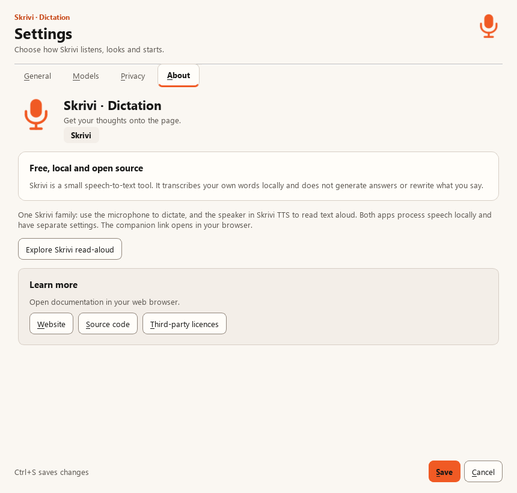
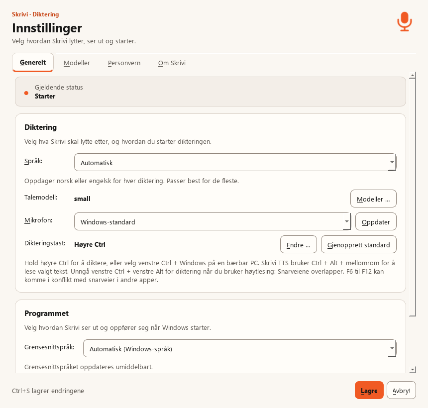

# Dictation in the Skrivi family

Implementation review, 20 September 2026.

The companion reference is Skrivi-TTS's `app/branding.py`, `app/theme.py` and
current reader documentation. Its speaker is orange (#F05A24), with rounded
geometry and a transparent background. The dictation app now uses a matching
microphone. Its existing theme is already the basis for the reader's theme;
retain that shared layout, spacing, typography and accessible Windows behaviour.

## Implemented

- One microphone renderer supplies live Qt icons and generated ICO/Store PNGs.
- Settings, About and tray titles identify Dictation / Diktering and retranslate
  live. Tray titles retain development build identifiers.
- About explains the two apps and offers a user-activated companion link.
- Settings, README and the dictation product page explain using both apps.
- Windows shortcut and app display names identify Skrivi Dictation. The installer
  removes the old app shortcuts when replacing them. AppId, package identity,
  startup IDs, executable, installation directory and data paths remain stable.
- No microphone, transcription, model or saved-shortcut behaviour changes.

The default STT Right Ctrl gesture does not overlap the TTS Ctrl+Alt+Space or
Ctrl+Alt+Shift+Space shortcuts. The optional STT Left Ctrl+Left Alt gesture can
activate before Space is pressed; recommend Right Ctrl or Left Ctrl+Windows
instead. Existing custom shortcuts remain under the user's control. The apps
do not inspect each other's saved configuration or automatically resolve it.

## Evidence and remaining checks

203 automated tests passed on Windows/Python 3.14, including live translation,
explicit companion-link activation, icon sizes, model/settings preservation,
installer identity and existing hotkey behaviour. Ruff formatting/lint and
module compilation passed. Qt renders were reviewed in English and Bokmål.

These are source previews, not screenshots of the currently published release.
Before release, verify an actual installer upgrade and both apps running together,
the taskbar/Start menu icon cache, Narrator, 200% text scaling, mixed-DPI displays
and Windows high-contrast themes. CI and packaged preview results belong in the
pull request. Existing release download links and released screenshots stay
accurate until the new package is published.
